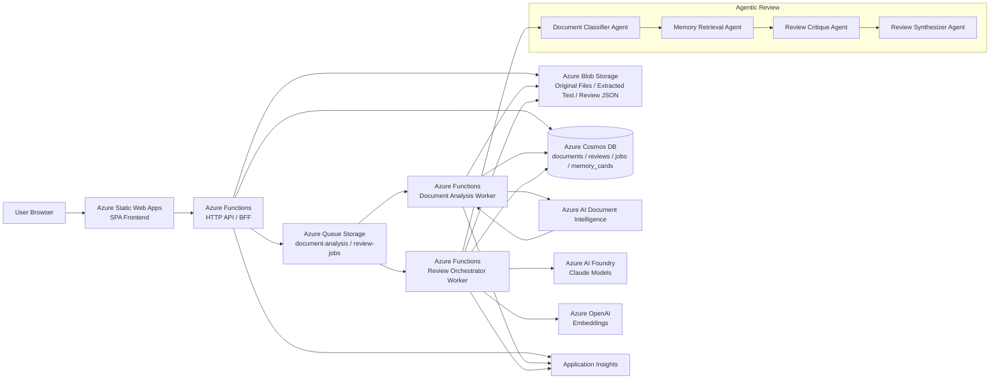

# Review Memory Agent Azure構成案

## 1. 目的

このドキュメントは、Review Memory Agent を Azure 上で MVP として構築するための構成案を整理したものである。

Review機能の詳細仕様は `docs/review-detailed-design.md` を参照する。
Memory機能の詳細仕様は `docs/memory-detailed-design.md` を参照する。
Apply機能の詳細仕様は `docs/apply-detailed-design.md` を参照する。
採用コンポーネントとモデルの判断は `docs/azure-component-decisions.md` を参照する。
実装用のリソース一覧と環境変数は `docs/infrastructure-implementation-guide.md` を参照する。

今回の前提は以下とする。

- 社内PoCとして始める
- 認証はまだ入れない
- 文書解析は Azure AI Document Intelligence を使う
- Review Memory は Cosmos DB に保存し、そのまま類似検索にも使う
- レビュー処理は Agentic に振る舞わせる
- 重い処理を前提に、レビューと文書解析は非同期ジョブで扱う

---

## 2. 採用方針

### 2.1 全体方針

MVPでは、まず以下を優先する。

- UI から見て分かりやすいこと
- 文書アップロードからレビュー完了までの流れが安定していること
- 原本、抽出結果、レビュー結果、Memory を一貫して追跡できること
- 後から認証や運用強化を追加しやすいこと

そのため、構成は以下を基本とする。

- フロントエンド: Azure Static Web Apps
- API / ワーカー: Azure Functions
- 原本保存: Azure Blob Storage
- 文書解析: Azure AI Document Intelligence
- メタデータ / Memory 保存: Azure Cosmos DB
- 非同期制御: Azure Queue Storage
- LLM / Agent 実行: Azure AI Foundry（Claude主力）+ Azure OpenAI Embeddings
- 監視: Application Insights

### 2.2 文書取り込みの基本設計

文書アップロード時は、API が最初に以下を確定する。

1. `documentId` を発行する
2. 原本を Blob Storage に保存する
3. Cosmos DB に文書メタデータを保存する
4. 文書解析ジョブを Queue に投入する

その後、ワーカーが Document Intelligence を呼び出して抽出を行う。

この方式を採用する理由は以下である。

- 原本が必ず Blob に残る
- Cosmos DB に親レコードを先に作れる
- Document Intelligence が失敗しても再実行しやすい
- クライアントが複数サービスへ直接送信しなくてよい
- 将来的に要約、分類、PII確認などの後続処理を追加しやすい

---

## 3. Azure構成図



---

## 4. コンポーネント構成

### 4.1 Azure Static Web Apps

役割:

- `prototype/` をもとにした SPA の配信
- Review / Memory / Apply の画面導線を提供
- API 呼び出しの起点

MVPでは認証を入れないため、ログインや権限制御は持たない。

### 4.2 Azure Functions

役割:

- フロントからの HTTP API を受ける
- 非同期ジョブを起動する
- 文書解析ワーカーを実行する
- Agentic なレビューオーケストレーションを実行する

想定する API:

- `POST /api/files`
- `POST /api/reviews`
- `GET /api/reviews/{reviewId}`
- `POST /api/memories/extract`
- `POST /api/memories`
- `GET /api/memories`
- `GET /api/memories/search`

### 4.3 Azure Blob Storage

役割:

- アップロードされた原本ファイルの保存
- Document Intelligence 抽出後のテキスト保存
- レビュー結果 JSON の保存

Blob を先に正本として置くことで、再解析や再レビューがやりやすくなる。

### 4.4 Azure Cosmos DB

役割:

- 文書メタデータの管理
- ジョブ状態の管理
- レビュー結果メタデータの管理
- Review Memory の正本管理

今回の構成では、Memory は Cosmos DB に保存し、類似検索も Cosmos DB で完結させる。
正本と検索先を分けないことで、MVPの構成をシンプルに保つ。

### 4.5 Azure Queue Storage

役割:

- 文書解析ジョブの非同期実行
- レビュージョブの非同期実行

同期APIの責務を軽くし、失敗時の再実行もしやすくする。

### 4.6 Azure AI Document Intelligence

役割:

- PDF / Word / PowerPoint のテキスト抽出
- レイアウトを考慮した解析

MVPでは独自パーサではなく、Document Intelligence を標準採用する。

### 4.7 Azure AI Foundry

役割:

- 文書タイプやレビュー観点の推定
- Review Memory の取得方針の補助
- 指摘、リスク、不足情報、修正案の生成
- 最終レビュー結果の統合
- 必要ページのみ画像・図のマルチモーダル解釈

採用方針:

- 主力モデルは Claude Sonnet 系
- 軽量タスクは Claude Haiku 系
- Claude は Azure AI Foundry 経由で利用する

### 4.8 Azure OpenAI Embeddings

役割:

- Review Memory の埋め込みベクトル生成
- Review 時の類似検索クエリ埋め込み生成

採用方針:

- Claude を主力にしても、埋め込みは Azure OpenAI を併用する
### 4.9 Cosmos DB ベクトル検索

役割:

- Review Memory の埋め込みベクトルを保持する
- 文書要約やレビュー条件に近い Memory を類似検索する

設計方針:

- `memory_cards` に本文と埋め込みベクトルを同居させる
- 正本と検索先を分けず、Cosmos DB 単体で完結させる
- MVPでは別の検索基盤は追加しない

---

## 5. 推奨フロー

### 5.1 文書アップロードから抽出まで

```text
1. ユーザーが資料をアップロードする
2. API が documentId を発行する
3. API が原本を Blob Storage に保存する
4. API が Cosmos DB に documents レコードを作成する
5. API が Queue に document-analysis job を投入する
6. Worker が Document Intelligence を呼び出す
7. 抽出結果を Blob Storage と Cosmos DB に反映する
8. document の status を extracted に更新する
```

### 5.2 レビュー実行

```text
1. ユーザーがレビュー条件を指定してレビューを開始する
2. API が reviewId を発行する
3. API が Cosmos DB に review_jobs レコードを作成する
4. API が Queue に review job を投入する
5. Worker が文書本文と条件を取得する
6. Agent 群が順に実行される
7. 結果を Blob Storage / Cosmos DB に保存する
8. review_jobs の status を completed に更新する
```

### 5.3 Memory 登録

```text
1. ユーザーがレビューコメントや会議メモを入力する
2. API が抽出ジョブまたは同期処理で候補論点を生成する
3. ユーザーが保存対象を選ぶ
4. API がレビュー方針カードを生成する
5. Cosmos DB の memory_cards に保存する
6. 次回レビュー時に自動適用対象として参照する
```

---

## 6. なぜ「APIからBlobとCosmos DBを先に確定し、解析は非同期」にするのか

設計上、今回の文書解析フローでは以下を採用する。

```text
Browser
  -> API
    -> Blob Storage に原本保存
    -> Cosmos DB に document レコード作成
    -> Queue に document-analysis job を投入
      -> Worker が Document Intelligence を実行
```

この方式を推す理由は以下である。

### 6.1 部分成功に強い

- Blob 保存は成功したが解析が失敗した
- Cosmos DB 保存は成功したが Document Intelligence 呼び出しが失敗した

といったケースでも、`documentId` を起点に再実行できる。

### 6.2 文書のライフサイクルを追跡しやすい

1つの `documentId` に対して、以下を自然にひも付けられる。

- 原本
- 抽出結果
- レビュー結果
- 適用された Memory
- 再解析履歴

### 6.3 API の応答が軽くなる

アップロードAPIの責務を、

- 受け付ける
- 保存する
- ジョブを作る

に絞れるため、ユーザー体験が安定する。

### 6.4 将来拡張しやすい

後から以下を追加しやすい。

- 要約ジョブ
- 自動分類ジョブ
- PII チェック
- サムネイル生成
- 埋め込み生成の再実行

一方で、API が Blob と Document Intelligence の両方へその場で同期送信する方式は、MVPでは実装できるが、失敗時の扱いと再実行の設計が複雑になりやすい。

---

## 7. Agentic Review の構成

レビュー処理は、1つの巨大なプロンプトではなく、複数の専門エージェントで進める。

### 7.1 Document Classifier Agent

役割:

- 資料タイプの推定
- レビュー目的候補の推定
- 重点観点候補の推定
- 想定レビュワー観点の推定

### 7.2 Memory Retrieval Agent

役割:

- 文書の要約や条件をもとに、Cosmos DB の Memory を検索する
- Cosmos DB のベクトル検索で関連度の高い Memory を取得する
- 今回適用すべきレビュー方針を絞り込む
- 適用理由を整理する

### 7.3 Review Critique Agent

役割:

- 文書本文と適用Memoryをもとにレビュー指摘を生成する
- リスク、不足情報、修正案を出す

### 7.4 Review Synthesizer Agent

役割:

- 各エージェントの結果を統合する
- スコアと総合判定を整形する
- 画面表示用の JSON にまとめる

### 7.5 MVPでの実装方針

MVPでは、複数エージェント構成ではあるが、実装は単一の Review Orchestrator Function が順番に制御する。

これにより、

- 役割は分ける
- 実装は複雑にしすぎない

というバランスを取る。

---

## 8. データモデルのたたき台

### 8.1 `documents`

保持したい項目:

- `id`
- `fileName`
- `blobPath`
- `contentType`
- `uploadStatus`
- `analysisStatus`
- `extractedTextPath`
- `createdAt`
- `updatedAt`

### 8.2 `review_jobs`

保持したい項目:

- `id`
- `documentId`
- `status`
- `currentStep`
- `requestedOptions`
- `resultPath`
- `createdAt`
- `updatedAt`

### 8.3 `reviews`

保持したい項目:

- `id`
- `documentId`
- `reviewJobId`
- `summary`
- `score`
- `appliedMemoryIds`
- `resultPath`
- `createdAt`

### 8.4 `memory_cards`

保持したい項目:

- `id`
- `title`
- `category`
- `criteria`
- `recommendedComment`
- `conditions`
- `embedding`
- `sourceType`
- `sourceText`
- `status`
- `createdAt`
- `updatedAt`

---

## 9. MVPでのスコープ

今回のMVPで含めるもの:

- テキスト貼り付けレビュー
- PDF / Word / PowerPoint のアップロード
- Document Intelligence による抽出
- 非同期ジョブによるレビュー実行
- Agentic なレビュー生成
- Cosmos DB への Memory 保存
- 次回レビュー時の Memory 自動適用

今回のMVPでまだ含めないもの:

- 認証 / 認可
- 閉域化
- Private Endpoint
- 管理者向け運用画面
- 厳密な監査ログ設計

---

## 10. 今後の拡張候補

- Entra ID による認証
- Memory 検索のランキング改善
- Durable Functions による長時間オーケストレーション
- Key Vault による秘密情報の集中管理
- Private Endpoint による閉域接続
- レビュー理由や適用根拠の可視化強化

---

## 11. まとめ

今回の Azure 構成では、以下を中心思想とする。

- 原本は先に Blob に置く
- Cosmos DB に親レコードを先に作る
- 文書解析とレビューは非同期ジョブに分ける
- Review Memory は Cosmos DB に置き、検索もそこで完結させる
- レビューは複数専門エージェントで Agentic に進める

この構成により、MVPとして素早く立ち上げつつ、後から認証、閉域化、運用強化を追加しやすい土台を作れる。
